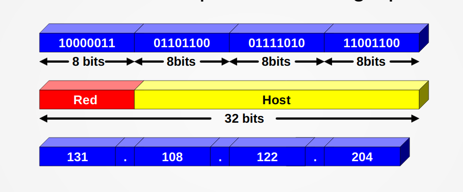
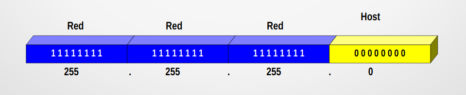
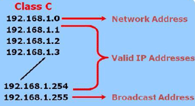

# Pràctica 6

## Conceptes

### Adreça IP

Adreça única de 32 bits separats en 4 grups de 8 bits



Les adreces IP consten de dues parts:

* La primera part de l’adreça identifica a  la xarxa (part de xarxa)
* La segona part identifica al host dins de la xarxa (part de host)

### Màscara de Xarxa

Es  una  adreça  de  32  bits  que  s’utilitza en el protocol IP per a indicar els bits d’una adreça IP que s’estan  utilitzant per a l’adreça de la subxarxa.

Definirem els bits d’una determinada adreça IP que  identifiquen  la  xarxa  (bits  a  1)  i  els  que identifiquen l’estació (bits a 0)



Aquesta mascara tambè es pot escriure com `\24` perque hi ha 24 bits que valen 1.

### Adreça de xarxa

L’identificador  de  xarxa serveix es un IP especial que es fa servir per a identificar tots els elements d'una xarxa. Totes les estacions d’una mateixa xarxa han d’utilitzar el mateix identificador de xarxa i totes les  estacions  han  de  tenir  la  mateixa  màscara per tal de poder comunicar-se entre elles.

És la primera IP de la xarxa, és a dir, la que té a 0 tots els bits de la part de host.


### Adreça de Broadcasting/Difusió

Una adreça IP amb tots els bits corresponents al host col·locats a 1 es coneix com a adreça de broadcast.

L’adreça   de   broadcast   de   la   xarxa 192.168.1.0/24 és, per tant, 192.168.1.255.
Un paquet enviat a aquesta adreça es lliurat a totes i cadascuna de les màquines de la xarxa 192.168.1.0/24.



A l'imatge també es veu l'adreça de Xarxa, que és la IP 192.168.1.0

Per tant, amb el mateix exemple, a la xarxa 192.168.1.0/24 tinc disponible 254 IPs degut a que la primera IP és l'adreça de Xarxa i la darrera és l'adreça de Broadcast. És a dir, tinc 256-2 = 254

## Exercicis

### Apartat 1

Si tinc la màquina amb IP 172.175.12.2 /16

* Escriu la màscara de xarxa en Notació Decimal Puntuada i en binari.
* Escriu la direcció de xarxa.
* Escriu la direcció de difusió.
* Si li assigno a un PC la direcció 172.175.14.0, és una direcció vàlida de la mateixa xarxa?

### Apartat 2

Especifica classe y tipus de les Ips següents

* 12.45.56.78
* 111.222.111.222
* 222.125.1.1
* 172.14.5.1
* 172.35.1.1
* 10.20.30.40
* 1.2.3.4

### Apartat 3

Si tinc la màquina amb IP 172.175.12.2 /22

* Escriu la màscara de xarxa en Notació Decimal Puntuada i en binari.
* Escriu la direcció de xarxa.
* Escriu la direcció de difusió.
* Si li assigno a un PC la direcció 172.175.14.0, és una direcció vàlida de la mateixa xarxa?

### Apartat 4

Donades les següents adreces IP d'equips i les màscares corresponents, troba l'adreça de xarxa i l'adreça de difusió. Dòna també la classe de la IP i si és pública o privada.

```
127.23.44.38 /27
12.34.66.198 /28
192.168.1.189 /30
120.120.120.23 /18
50.60.70.80 /6
```

### Apartat 5

Comprova si les següents parelles d'ordinadors estan en la mateixa xarxa:

```
172.120.34.78 /21
172.120.60.30 /21

192.168.1.130 /27
192.168.1.160 /27

20.10.1.152 /6
30.100.212.122 /6
```

### Apartat 6

En una xarxa /24 puc tenir 254 ordinadors. Per què?

    Doncs /24 significa que dels 32 bits de la IP, 24 són de la part de xarxa i 8 són de la part de host.
    Per tant, tinc 2^8 combinacions diferents de la part de host.
      2^8 = 256
    I he de restar 2 per que la primera és l'adreça de xarxa i la darrera és l'adreça de difusió.
      256 - 2 = 254

Quants ordenadors podem tenir en una xarxa /26? I en una /14?

### Apartat 7

Si tinc la màquina amb IP 192.168.4.2 /25

* Escriu la màscara de xarxa en Notació Decimal Puntuada i en binari.
* Escriu la direcció de xarxa.
* Escriu la direcció de difusió.
* Si li assigno a un PC la direcció 192.168.4.120, és una direcció vàlida de la mateixa xarxa?
* Si li assigno a un PC la direcció 192.168.4.150, és una direcció vàlida de la mateixa xarxa?


### Apartat 8

Si tinc la màquina amb IP 10.220.5.7 / 10

* Escriu la màscara de xarxa en Notació Decimal Puntuada i en binari.
* Escriu la direcció de xarxa.
* Escriu la direcció de difusió.
* Si li assigno a un PC la direcció 10.192.0.21, és una direcció vàlida de la mateixa xarxa?
* Si li assigno a un PC la direcció 10.221.5.6, és una direcció vàlida de la mateixa xarxa?

### Apartat 9

Si tinc la màquina 192.168.43.3 i la 192.168.5.23. Tria la màscara adequada perquè sent ambdues de la mateixa xarxa, aquesta xarxa tingui el major nombre d'ordinadors possible.


### Apartat 10

Si tinc la màquina amb IP 10.4.5.6 / 12

* Escriu la màscara de xarxa en Notació Decimal Puntuada i en binari.
* Escriu la direcció de xarxa.
* Escriu la direcció de difusió.
* Si li assigno a un PC la direcció 10.12.255.7, és una direcció vàlida de la mateixa xarxa?
* Si li assigno a un PC la direcció 10.19.255.6, és una direcció vàlida de la mateixa xarxa?
