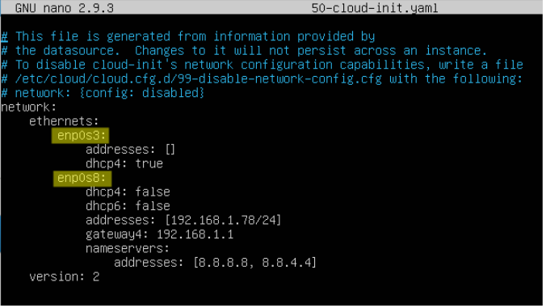
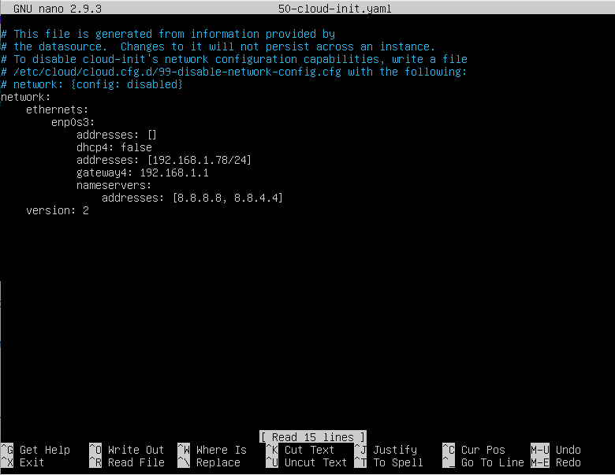

# Pràctica 7

## 1. Xarxa NAT amb Virtual BOX

Primer de tot, crea una xarxa NAT pròpia amb VirtualBox:

Farem servir la xarxa privada 192.168.1.0/24

:bangbang: Consulta l'enllaç següent i prova d'entendre i explicar AMB LES TEVES PAREULES quines opcions de xarxa permet Virtual Box i en que consisteixen: https://www.virtualbox.org/manual/ch06.html#networkingmodes

## 2. Ubuntu Server 18.04 LTS

Crea una nova màquina virtual con VirtualBox fent servir la ISO **ubuntu-18.04.1-live-server-amd64.iso** que tens al repositori samba del Institut. Selecciona com a xarxa la xarxa NAT que has creat en el punt anterior i posa-li un disc dur dinàmic de 10GB i 1 GB de RAM. Com a hostname has de posar el teu nom i el mòdul, és a dir, en el meu cas seria **m05-alfonso**. No cal documentar el procés d'instal·lació.

:bangbang: Respon, amb les teves paraules, a les següents preguntes:

1. Què vol dir LTS?
2. Fins quan té suport aquesta versió que has instat·lat?
3. Quina diferència hi ha entre un Ubuntu Server i un Ubuntu Desktop?
4. Per a que es fa servir generalment un Ubuntu Server (o qualsevol altre distribució similar)? Pots buscar informació sobre aquest punt en aquest enllaç: https://es.godaddy.com/blog/que-es-ubuntu-y-para-que-sirve/

## 3. Comanda lshw

Executa les següents comandes i fes captura de pantalla dels resultats:

    sudo lshw | more
    
    sudo lshw -class network
    
    sudo lshw -class network -short

:bangbang: Busca i tracta d'explicar, AMB LES TEVES PARAULES, què fa la comanda lshw. Pots buscar-ho per internet i/o també pots buscar informació amb la comanda `man`:

	man lshw

## 4. Comanda ethtool

A la columna Device de la darrera instrucció apareix el nom de la targeta de xarxa que tindràs. En el meu cas es diu *enp0s3*. Executa la instrucció següent possant, si cal, el nom del teu dispositiu de xarxa enlloc del *enp0s3*. Recorda fer captura de pantalla del resultat:

	sudo ethtool enp0s3

:bangbang: Quina informació surt? Què fa la comanda ethtool? Igual que abans, pots consultar-ho amb la comanda `man`:

	man ethtool

## 5. Loopback

:bangbang: Executa ara la comanda `ip a`. Quantes targetes de xarxa apareixen? Hi ha una que és diu **loopback**. Busca informació sobre que és i per a que serveix. Pots consultar aquest enllaç si vols: https://askubuntu.com/questions/247625/what-is-the-loopback-device-and-how-do-i-use-it

## 6. IFCONFIG

La comanda UNIX/LINUX `ifconfig` (de interface configurator, configurador d'interfícies) serveix per configurar i controlar interfícies de xarxa TCP/IP des de la línia de comandes.

Els usos habituals de l'ifconfig inclouen configurar l'adreça IP d'una interfície i la seva màscara de xarxa, i deshabilitar o habilitar una certa interfície. A l'arrencada, moltes distribucions tipus UNIX inicialitzen les seves interfícies de xarxa amb «shell-scripts» que criden l'ifconfig.

La comanda ifconfig accepta diversos paràmetres. Generalment si s'executa en la forma:

    ifconfig interfície [adreça [paràmetres] ]

On:

La interfície és el nom de la interfície i adreça és l'adreça IP que s'assigna a aquesta interfície.

Si ifconfig s'executa afegint únicament el nom de la interfície, presentarà la informació de la configuració d'aquesta interfície. Si s'executa sense paràmetres, presenta totes les interfícies configurades fins al moment.

Com a exemple, la consulta de la configuració de la targeta de xarxa `enp0s3` seria:

    ifconfig enp0s3

:bangbang: Fes captura de pantalla executant aquesta comanda

Les línies RX i TX donen idea dels paquets rebuts o transmesos sense errors, del nombre d'errors ocorreguts, de quants paquets han estat descartats (segurament per memòria insuficient), i quants han estat perduts per desbordament, condició que ocorre quan la recepció de paquets és massa ràpida i el nucli és incapaç de donar servei al paquet anterior abans de l'arribada del nou paquet.

:bangbang: Observa que es mostra un valor de MTU. Quin valor és? Busca a l'enllaç següent que vol dir MTU i explica-ho amb les teves paraules: https://es.wikipedia.org/wiki/Unidad_m%C3%A1xima_de_transferencia

Consulta el manual següent https://www.computerhope.com/unix/uifconfi.htm i fes les tasques següents:

:bangbang: Deshabilita la teva targeta de xarxa i comprova que no tens xarxa fent ping a la màquina 8.8.8.8

:bangbang: Torna a habilitar la targeta de xarxa i comprova que tens xarxa fent de nou un ping. Pot trigar una mica en habilitar-se la xarxa!

## 7. ROUTE

Consula l'enllaç següent i explica amb les teves pròpies paraules que és la taula d'enrutament i que fa la comanda `route` : https://linuxhint.com/route_command_linux/
Fes una captutura de pantalla executant la comanda `route -n`. 

La manera que fa servir la taula d'enrutament el teu equip és mirant primer les instruccions més específiques i les més generals al final.

Les decisions d'enrutament són bastant senzilles per a la majoria d’equips:

* Si el destí es troba a la xarxa local, envieu les dades directament al destí.
* Si el destií es troba en una xarxa remota que es pot accedir mitjançant una passarel·la local (*gateway*) que apareix a la taula d'encaminament, envieu-la a la passarel·la definida explícitament.
* Si el destí es troba en una xarxa remota i no hi ha cap altra entrada que defineixi una ruta cap a aquest amfitrió, envieu les dades a la passarel·la predeterminada.

:bangbang: Explica que volen dir els flags que aparareixen quan executes la comanda `route -n` fent servir l'enllaç següent: https://www.thegeekstuff.com/2012/05/route-flags/

## 8. IP

Mostra i manipula rutes i dispositius de xarxa. Si executem `ip addr` obtindrem informació similar a executar la comanda `ifconfig`, però amb un format diferent.

:bangbang: Fes una captura de pantalla executant la comanda `ip a` (és el mateix que `ip addr`) 

Si fem `ip route` es mostra informació similar a executar la comanda route, pero amb un format diferent i afegint-hi la porta d’enllaç. 

:bangbang: Fes una captura de pantalla executant la comanda `ip route`.

:bangbang: Consula l'enllaç següent i, com has fet abans amb la comanda `ifconfig`, deshabilita (`down`) i habilita (`up`) la targeta de xarxa fent servir la comanda `ìp`: https://linuxize.com/post/linux-ip-command/

## 9. Netplan

A partir de la versió 17.10 de l’Ubuntu la utilitat que ens permet modificar la configuració de xarxa d’un sistema textual es denomina Netplan.

L’arxiu de text de configuració de la xarxa serà un arxiu amb extensió .yaml que es trobarà a la carpeta `/etc/netplan`.

Per a fer la configuració de les targetes de xarxa editarem l'arxiu (per a fer-ho cal fer servir la comanda sudo nano `/etc/netplan/50-cloud-init.yaml`).  Allà llistarem totes les targetes del sistema i les hi donarem la configuració que vulguem.

*NOTA: per editar fitxers farem servir la comanda nano, que haurem d’executar amb privilegis de root per tal de poder guardar els canvis que realitzem.*

https://www.nanotutoriales.com/tutorial-del-editor-de-texto-nano

En el fitxer exemple de la captura de pantalla anterior podem veure dues interfícies de xarxa configurades, `enp0s3` i `enp0s8`.

La primera està configurada per obtenir els seus paràmetres IP via DHCP i la segona està configurada estàticament.

Els paràmetres a configurar que hi apareixen són:

* enp0s8: nom de la interfície de xarxa a configurar
* dhcp4 i dhcp6: fa referència al mètode de DHCP d'una interfície per a IPv4 i IPv6 respectivament. Si assignem a aquest paràmetre el valor true configurarem la interfície per a a obtenir els seus paràmetres IP via DHCP. Si li assignem el valor false haurem de configurar-los nosaltres estàticament:
* addresses: per definir l’adreça IP estàtica per a la interfície.
* gateway4: permet definir la portal d’enllaç per defecte que utilitzarà la interfície.
* nameservers: seguit de nou d’una línia amb el camp adresses: permet definir les d'adreces IP dels servidors DNS que utilitzarà la interfície de xarxa.

:bangbang: Modifica el teu fitxer `/etc/netplan/50-cloud-init.yaml` i configura la teva targeta de xarxa amb l'adreça estàtica `192.168.1.78` i la resta de paràmetres tal i com pots veure a la imatge següent:

Per aplicar els canvis, executo `sudo netplan apply` i comprova amb la comanda `ip a` que tens l'adreça IP `192.168.1.78` 

:bangbang: Comprova amb la comanda `nslookup` quins servidors DNS tens configurat. Per fer-ho, executa la comanda ` nslookup twitch.tv`. La linea que comença per `Server:` t'indica quin servidor DNS estàs fent servir.

:bangbang: Esbrina que fa la comanda `nslookup` consultant l'enllaç: https://es.wikipedia.org/wiki/Nslookup

:bangbang: Modifica de nou el fitxer i torna a posar la configuració inicial per DHCP. Executa de nou `sudo netplan apply` i comprova amb la comanda `ip a` quina adreça IP tens.

## 10. networkctl

Abans d'utilitzar aquesta eina cal assegurar-se que **systemd-networkd** està funcionant en el sistema. **systemd-networkd** és un dimoni del sistema que fa servir les configuracions de xarxa. Detecta i configura els dispositius de xarxa del sistema.

Podem executar aquesta comanda per conèixer l'estat del dimoni:

	sudo systemctl status systemd-networkd

Si veiem que no està executant-se, hauríem de fer el següent:

	sudo systemctl start systemd-networkd

I evidentment, també podem aturar el servei amb:

	sudo systemctl stop systemd-networkd

:bangbang: Comproveu que el servei systemd-networkd està efectivament funcionant al vostre sistema.

Un cop comprovem que està executant-se, simplement hem de llançar la comanda `networkctl` o `networkctl -a`. Aquí apareixerà el resum dels dispositius de xarxa i l'estat dels mateixos.

:bangbang: Per mostrar informació sobre els enllaços especificats, com tipus, estat, controlador del mòdul del nucli, maquinari i adreça IP, DNS configurat, servidor i altres, cal usar la comanda d'estat `networkctl status`. Fes una captura de pantalla mostrant l'execució d'aquesta comanda.

:bangbang: Si volem veure l'estat d'un dispositiu en concret, cal utilitzar la comanda `networkctl status "nom"`. Hem de canviar "nom" pel nom del dispositiu que volem. Executa la comanda anterior posant el nom de la teva targeta de xarxa.

