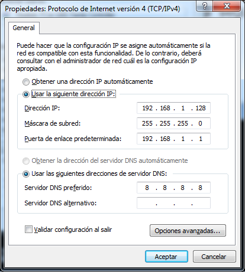

# Pràctica 8

En aquesta pràctica treballarem amb diverses utilitats que incorporen els sistemes operatius Windows, tant en mode gràfic com mitjançant interfície de comandes, que permeten la configuració del subsistema IP del sistema al qual s'allotgen.

Per fer-ho, utilitzarem una màquina virtual **Windows 10** dins del nostre sistema amfitrió Linux, de manera que puguem gaudir de privilegis administratius en tot moment i no ens trobem amb cap limitació a l'hora de poder modificar la configuració del nostre sistema, alhora que preservem la integritat de la màquina amfitriona.

La màquina virtual hauria de disposar d'una interfície de xarxa virtual incorporada i configurada en mode **Xarxa NAT** amb la configuració de Xarxa NAT que vam crear a la pràctica anterior.

## CONFIGURACIÓ DELS PARÀMETRES BÀSICS DE XARXA EN MODE GRÀFIC

Qualsevol sistema informàtic connectat a una xarxa TCP/IP necessita de dos paràmetres fonamentals a nivell de Xarxa (Nivell 3 OSI) per tal de poder tenir-hi connectivitat.

- Adreça IP
- Màscara de xarxa

I apart, necessitarem dos paràmetres més molt importants de cara a poder navegar per Internet:

- Adreça de la porta d'enllaç o gateway de la nostra xarxa
- Adreça dels servidors DNS amb que treballarem

---
:bangbang: **1.** Llegeix el següent article i explica, amb les teves paraules, que és la **porta d'enllaç** i que vol dir **NAT**: https://naseros.com/2020/05/26/que-es-la-ip-privada-nat-y-puerta-de-enlace-curso-de-redes-dede-0-cap-2-2020/

---

Anem a configurar la nostra màquina des del subsistema gràfic. Per fer-ho, aneu seguint les passes següents:

1. En primer lloc anirem al Panel de Control, triarem Redes e Internet i després Centro de redes i recursos compartidos, fins a arribar a una pantalla similar a aquesta:

2. En ella haurem de triar la opció Cambiar configuración del adaptador i arribarem a una finestra com aquesta:

En ella visualitzarem tots els adaptadors de xarxa instal·lats al nostre sistema, i haurem de triar quin d'ells volem configurar, normalment Conexión de área local, tot i que el nom pot variar depenent de la configuració del sistema.

3. Un cop triada la connexió de xarxa que volem configurar, ens trobarem amb la pantalla següent:

4. Si seleccionem Detalles, visualitzarem la configuració actual de l'adaptador

Com podem observar, aquí podem visualitzar els quatre paràmetres IP fonamentals dels que hem parlat amb anterioritat (Dirección IPv4, Máscara de subred IPv4, Puerta de enlace predeterminada IPv4 i Servidor DNS IPv4).

La resta de paràmetres de moment els obviarem, tot i que a grans trets corresponen als equivalents als quatre anteriors per a IPv6 en cas de tenir-lo habilitat, l'adreça física o MAC de la interfície de xarxa (paràmetre important per moltes aplicacions) i d'altres.

Tancarem ara la finestra anterior i tornarem ara a la de la passa 3.

5. Seleccionem ara Propiedades, i després farem doble clic sobre Protocolo de internet versión 4 (TCP/IPv4) i arribarem a la següent pantalla de configuració:

---
:bangbang: **2.** Arribats en aquest punt, configurarem els paràmetres fonamentals de xarxa deshabilitant l'opció d'obtenir-los automàticament.

Es paràmetres que haureu de configurar seran:

- Adreça IP: Fareu servir una IP del la vostra xarxa NAT: 192.168.1.123

- Màscara de subxarxa: serà la de 24 bits, 255.255.255.0

- Porta d'enllaç predeterminada: serà l'adreça IP del router virtual de la nostra subxarxa, que fa aquesta funció, 192.168.1.1

- Servidor DNS preferit: farem servir un dels servidors de opendns. Busca quins són a https://www.opendns.com/

- Servidor DNS alternatiu: posa l'altre servidor DNS d'opendns.

Enganxeu aquí la captura de pantalla de la configuració final i després podeu seleccionar Acceptar i Acceptar una segona vegada, per tal que s'apliqui. 

Enganxeu ara una segona captura de pantalla de l'opció Detalles per visualitzar que efectivament els canvis a la configuració s'han aplicat correctament.

Respón també a la pregunta següent: per quina raó és recomenable fer servir un DNS com el d'opendns?

---

6. Ara podem tancar i haurem finalitzat aquesta part de la pràctica.

## CONFIGURACIÓ AUTOMÀTICA DELS PARÀMETRES DE XARXA

Si tornem una mica enrere en el desenvolupament de la pràctica, recordarem que en un moment donat podíem triar les opcions de configuració de la targeta de xarxa Obtener una dirección IP automáticamente i Obtener la dirección del servidor DNS automáticamente.

Per entendre aquestes dues possibilitats de configuració, haurem d'investigar de nou una mica, navegant per Internet. I concretament haurem d'investigar sobre un protocol ben conegut i popular:  DHCP.

Wikipèdia està prou bé, almenys per començar.

---
:bangbang: **3.**  Respon a les següents qüestions:

- Què és i quina funció té el protocol DHCP?

- Com funciona? Quins missatges intercanvien client i servidor?

- Quins tres mètodes d'assignació fonamentals implementa?

- Quins paràmetres assigna el servidor al client?

- Què és i quina funció té el Identificador de classe DHCP d'una targeta de xarxa (vendor class in English)?

---

---
:bangbang: **4.**  Arribats en aquest punt, configureu els paràmetres fonamentals de xarxa per tal d'obtenir-los automàticament. Expliqueu el procediment seguit, amb captures de pantalla si cal, i enganxeu novament una captura de pantalla de l'opció *Detalles* per visualitzar quins paràmetres IP heu obtingut automàticament del servidor DHCP del centre.

---

## CONFIGURACIÓ DELS PARÀMETRES BÀSICS DE XARXA EN MODE TEXT

Normalment, la configuració bàsica del subsistema de xarxa d'un sistema Windows la durem a terme en mode gràfic, però la possibilitat de fer-la des de la línia de comandes (cmd) permet la implementació de programes senzills que permetin automatitzar per exemple tasques repetitives.

### INSTRUCCIÓ IPCONFIG

La utilitat ipconfig permet visualitzar, des de la línia de comandes, els valors actuals de la configuració de la xarxa TCP/IP,  així com actualitzar la configuració de DHCP (Protocol de configuració dinàmica de host) i DNS (Sistema de noms de domini).

Si s’utilitza sense paràmetres, ipconfig mostra l’adreça IP, màscara de subxarxa i porta d’enllaç predeterminada de tots els adaptadors:

Els diversos paràmetres *ipconfig* que estudiarem son:

    [/all]
    [/renew [adaptador]]
    [/release [adaptador]]
    [/flushdns]
    [/registerdns]
    [/showclassid adaptador]
    [/setclassid adaptador [IdDeClase]]
    [/displaydns]

**[/all]**

Sintaxi: ipconfig /all

Mostra la configuració de TCP/IP completa de tots els adaptadors presents a l’equip (interfícies IP). Sense aquest paràmetre, ipconfig només mostrarà els valors d’adreça IP, la màscara de subxarxa i la porta d’enllaç predeterminada per a cada adaptador. Els adaptadors poden representar a interfícies físiques, com les targetes de xarxa instal·lades, o interfícies lògiques, com les connexions d’accés telefònic a xarxes o els adaptadors virtuals.

### OPCIONS IPCONFIG RELACIONADES AMB DHCP:

**[/renew [adaptador]]**

Renova la configuració de DHCP de tots els adaptadors (si no s’especifica un adaptador concret) o d’un adaptador específic, si s’inclou el paràmetre adaptador. Aquest paràmetre només està disponible en equips que disposen d’adaptadors configurats per a obtenir una adreça IP automàticament. Per a especificar un nom d’adaptador, escriu el nom d’adaptador que apareix quan s’utilitza ipconfig sense paràmetres. 

**[/release [adaptador]]**

Envia el missatge DHCPRELEASE al servidor DHCP per a alliberar la configuració actual de DHCP i descartar la configuració d’adreça IP per a tots els adaptadors (si no s’especifica un de concret) o per a un adaptador específic si s’inclou el paràmetre adaptador. Aquest paràmetre deshabilita TCP/IP per als adaptadors configurats per a obtenir una adreça IP automàticament. Per a especificar un nom d’adaptador, escriu el nom d’adaptador que apareix quan s’utilitza ipconfig sense paràmetres. 

**[/showclassid adaptador]**

Mostra el Id. de classe de DHCP de l’adaptador especificat. Per a veure el Id. de classe de DHCP de tots els adaptadors, utilitza el caràcter comodí asterisc (*) en lloc d’adaptador. Aquest paràmetre només està disponible en equips que disposen d’adaptadors configurats per a obtenir una adreça IP automàticament.

**[/setclassid adaptador [idDeClase]]**

Configura el Id. de classe de DHCP de l’adaptador especificat. Per a establir el Id. de classe de DHCP de tots els adaptadors, utilitza el caràcter comodí asterisc (*) en lloc d’adaptador. Aquest paràmetre només està disponible en equips que disposen d’adaptadors configurats per a obtenir una adreça IP automàticament. Si no s’especifica un Id. de classe de DHCP, s’elimina el Id. de classe actual. 

---

:bangbang: **5.**   Mitjançant la comanda ipconfig i el paràmetre dels anteriors que considereu necessari, forceu la vostra interfície de xarxa per què alliberi l’adreça IP que té assignada per DHCP i demani una de nova al servidor del centre. Documenteu el procediment seguit amb captures de pantalla.

---

---
:bangbang: **6.**  Un cop fet això, visualitzeu mitjançant ipconfig /all la configuració obtinguda i indiqueu els valors concrets dels quatre paràmetres IP fonamentals que us ha donat el servidor (Dirección IPv4, Máscara de subred IPv4, Puerta de enlace predeterminada IPv4 i Servidor DNS IPv4).

Per últim localitzeu també l'adreça MAC de la vostra interfície de xarxa en la sortida corresponent a la comanda anterior.

---

### OPCIONS IPCONFIG RELACIONADES AMB DNS:

[/flushdns]

Buida i restableix el contingut del servei de resolució de la cache de clients DNS. Durant la solució de problemes de DNS, es pot utilitzar aquest procediment per a descartar entrades de resultats negatius a la cache i altres entrades agregades dinàmicament.

[/registerdns]

Inicia el registre dinàmic manual dels noms DNS i adreces IP configurades a l’equip. Es pot utilitzar aquest paràmetre per a solucionar problemes en el registre de noms DNS o per a resoldre un problema d’actualització dinàmica entre un client i un servidor DNS sense haver de reiniciar el client. La configuració de DNS de las propietats avançades del protocol TCP/IP determina quins noms es registren en DNS.

[/displaydns]

Mostra el contingut del servei de resolució de la cache del client DNS, que inclou les entrades carregades prèviament des de l’arxiu Hosts local i els registres de recursos que s’hagin obtingut recentment per a consultes de nom resoltes per l’equipo. El servei Client DNS utilitza aquesta informació per a resoldre ràpidament els noms consultats freqüentment, abans de consultar als seus servidors DNS configurats.

Per entendre aquests paràmetres, haurem d'investigar de nou una mica, navegant per Internet. I concretament haurem d'investigar sobre un altre protocol també ben conegut i popular:  DNS. Wikipèdia torna a estar prou bé, almenys per començar.

---
:bangbang: **7.**  Respon en un màxim de dues pàgines les següents qüestions:

- Què és i quina funció té el protocol DNS?
- Quins components conformen el sistema DNS?
- Quins dos tipus de consultes fonamentals implementa el protocol DNS?
- Quins són els tipus de registres DNS més importants?
- Què és una caché DNS?

---

---
:bangbang: **8.**   Navegueu una estona per Internet i visualitza mitjançant la utilitat ipconfig i el paràmetre corresponent el contingut de la cache DNS del vostre sistema. Documenteu el procediment seguit amb captures de pantalla.

Esborreu ara mitjançant la utilitat ipconfig i el paràmetre corresponent el contingut de la cache DNS i comproveu que realment la comanda ha sortit efecte. Documenteu el procediment seguit amb captures de pantalla.

---

## UTILITAT NETSH

Netsh es una utilitat de línia de comandes que ens ofereix opcions per la configuració de xarxa. Entre les principals opcions que es poden realitzar, esta la possibilitat de veure, modificar, administrar i diagnosticar la configuració de la xarxa local. 
	
A la línia de comandes (executarcmd) s’ha d’escriure netsh i entrarem a l’entorn, de forma que canviarà el prompt a:

			netsh
			netsh>

Per tal d’obtenir ajuda sobre la comanda podem fer:

			netsh /?

O dins de netsh:

			netsh>?

Les diverses comandes que es poden fer servir són:

### EXEMPLES DE FUNCIONAMENT

1. El primer que volem fer en aquesta pràctica es fer una còpia de seguretat de totes les dades abans de fer cap modificació. Com es pot fer això? Doncs fent servir la comanda: per fer-ho Inicialment obrirem una finestra MSDos (executar cmd) i posarem:

		netsh -c interface dump > arxiu.txt

2. Un cop fet la còpia de seguretat ja podem començar a manipular l’entorn sense por de fer malbé la configuració. Posem:

		netsh

3. Per tal de conèixer les comandes que es poden introduir posarem ? prova-ho!! i a més a més podem posar també ? al costat d’una altra comanda per veure quins paràmetres li podem passar, aquests poden variar segons el context en el que ens situem. Per exemple:

		netsh>show ?

4. La comanda anterior no mostra el mateix que si fiquem les següents, la primera canvia al context del interface, la segona al context de l’adreçament ip i la tercera ens indica què es pot mostrar dins del context actual (ip). Prova-ho.

        netsh > interface
        netsh interface> ip
        netsh interface ip> show ?

5. Per tornar al context anterior cal introduir la comanda:  
		.. 

6. Per veure les interfícies de xarxa disponibles al nostre sistema operatiu:

		netsh > interface
		netsh interface> show interface

7. Per tal de canviar la configuració ip d’una connexió caldrà que feu servir el següent patró:

		netsh> interface ip set address "Nom de la targeta" static adreça IP màscara gateway mètrica

    * On "Nom de la targeta" ha de ser el nom de la connexió d’àrea local.
    * On adreça IP és la nova adreça que volem posar
    * On màscara es la mascara de xarxa nova que volem posar
    * On gateway es la nova porta d’enllaça a fer server (normalment el router)
    * On la mètrica és normalment 1

8. Per tal de canviar l’adreçament del dns haureu de fer servir el següent patró

		netsh> interface ip set dns "Nom de la tarja" static adreça DNS primary

9. Per eliminar un servidor dns  hauries de fer servir el següent patró:

		netsh> interface ip delete dns "Nom de la tarja" ip DNS a esborrar

10. Per agafar la configuració d’un servidor dhcp s’haurà de fer servir el següent patró.
    
    	netsh> interface ip set address "Nom de la tarja" dhcp
    
11. Per  agafar la configuració del DNS del servidor dhcp s’ha de fer servir el següent patró
    
    	netsh> interface ip set dns "Nom de la tarja" dhcp
    
12. Per recuperar la configuració guardada en un arxiu es pot fer mitjançant la següent comanda.
    
    	netsh -f arxiu.txt

---

:bangbang: **9.** Fem servir netsh:

1. Fent servir la utilitat netsh, fes una còpia de seguretat  de l’entorn de xarxa a un arxiu anomenat xarxa.txt. Indica quina comanda fas servir.

2. Fent servir les comandes anteriors, mostra el llistat de les targetes de xarxa configurades (interfaces) al sistema. Indica quina comanda fas servir.

3. Fent servir les comandes anteriors, visualitza la configuració ip de la targeta “Conexión de área local” al sistema. Indica quina comanda fas servir.

4. Dins del context interface i ip, canvia la ip de la “connexió d’àrea local” a una de l’aula que no estigui utilitzada (demaneu al professor) i verifica fent servir la comanda show que s’ha canviat correctament. (fixeu-vos al pas 6).

5. Canvia el dns de la interfície “Connexió d’àrea local” al 8.8.8.8 (primari). Indica quina comanda fas servir i verifica que ha funcionat.

6. Elimina el  servidor dns que has configurat . Indica quina comanda fas servir i verifica que ha funcionat.

7. Fes que la connexió d’àrea local torni a agafar la configuració ip del servidor dhcp (ip dinàmica). Indica quina comanda fas servir i verifica que ha funcionat. Quina adreça ha obtingut del servidor DHCP del centre?

8. Fes que la connexió d’àrea local agafi la configuració del DNS del servidor dhcp. Indica quina comanda fas servir i verifica que ha funcionat. Quina adreça de servidor de noms ha obtingut? Ha canviat?

9. Ara, fes una recuperació de la configuració inicial de la xarxa de l’arxiu xarxa.txt. Indica quina comanda fas servir i verifica que ha funcionat.

10. Explica per a què creus que pot servir la configuració de la xarxa des de comandes enlloc de fer servir les finestres de Windows.

---
